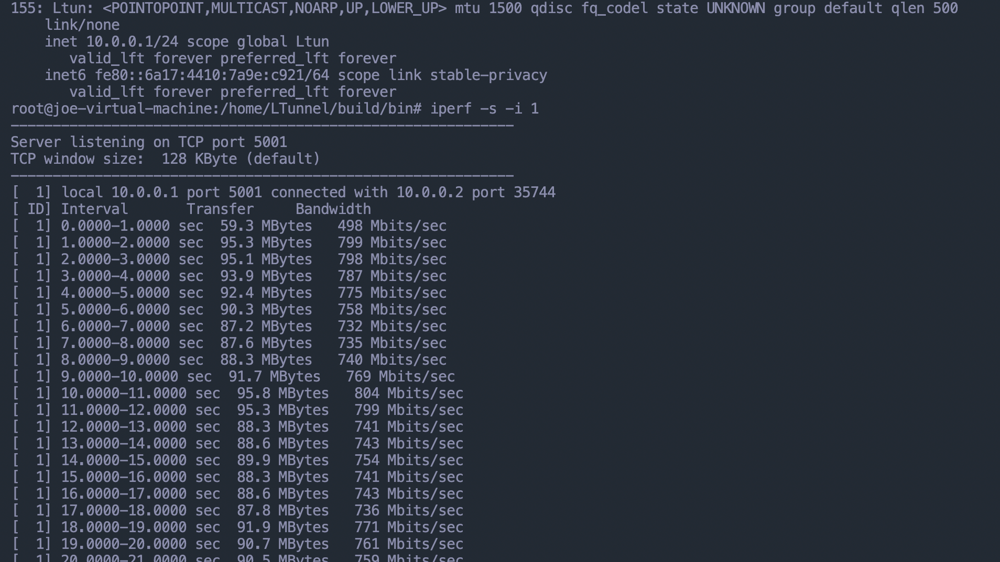
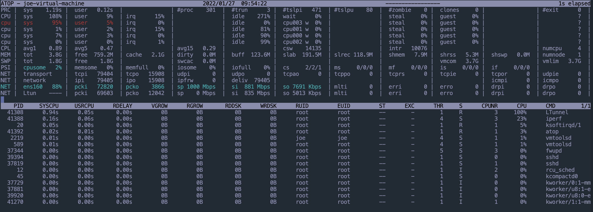

# LTunnel 

Tunnel example by tun interface.
It is implemented by Libev.

Simple performance test:

Vitual machine on VMware Fusion, Apple Macbook Pro M1Pro, 4 CPU, 4GB RAM. Ubuntu 22.04.

IPerf 1 TCP stream.

Maybe I will use openssl for encryption/decryption, and add the connection management feature for the muti-client.